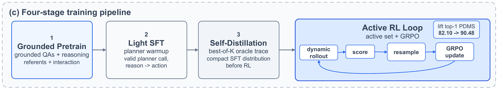
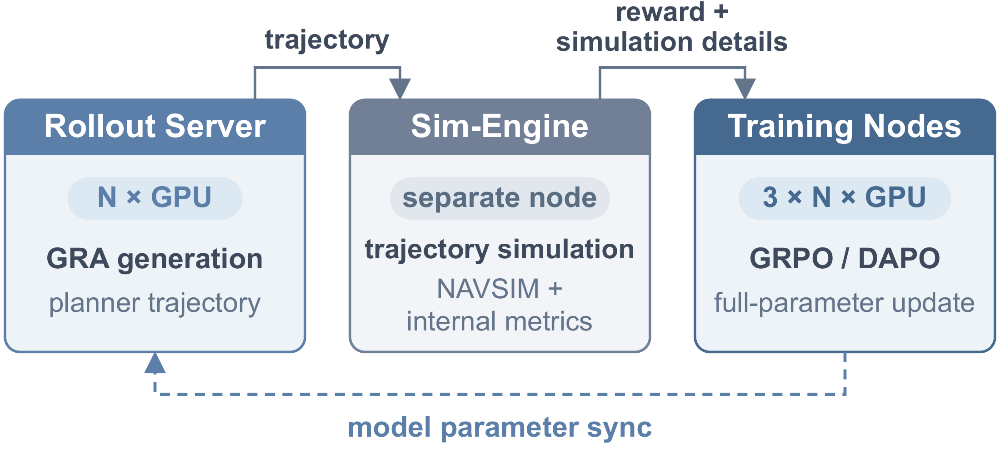

<div align="center">
  
  <h1>GRAVA Train</h1>
  <p><strong>训练有场景依据的自动驾驶推理与动作模型。</strong></p>
  <p>
    <a href="https://github.com/AhernResearch/grava"></a>
    <a href="https://arxiv.org/abs/2609.15169"></a>
    <a href="#数据与模型"></a>
    <a href="#文档导航"></a>
  </p>
  <p><a href="README.md">English</a> | <strong>简体中文</strong></p>
  <p>
    <a href="#训练流程">训练流程</a> ·
    <a href="#快速开始">快速开始</a> ·
    <a href="#训练与评测">训练与评测</a> ·
    <a href="#数据与模型">数据与模型</a> ·
    <a href="#引用">引用</a>
  </p>
</div>

## 概览

GRAVA Train 用于训练和评测自动驾驶视觉语言动作模型（VLA），支持监督微调、强化学习和轨迹评测。
你可以使用现有配方复现 [GRAVA](https://github.com/AhernResearch/grava) 的训练流程，也可以在此基础上开展新的实验。

感谢 [Qwen](https://github.com/QwenLM/Qwen3-VL) 团队出色的开源模型，以及
[ms-swift](https://github.com/modelscope/ms-swift) 团队提供的训练基础设施。
我们在此基础上接入自动驾驶的轨迹生成、仿真评分和强化学习流程。

强化学习支持训推分离。训练、推理和仿真评分可以部署在不同机器上，分别调度和维护。
需要训练更大的模型或增加采样时，可以分别扩展训练和推理资源。
Active RL 则根据当前模型的表现筛选下一轮训练场景。

| 功能 | 支持的流程 |
| --- | --- |
| 监督学习 | GRA 预训练、教师监督的动作预热 SFT；支持全量微调和 LoRA |
| 自蒸馏 | 拒绝采样选择完整模型回答，作为下一轮 SFT 的训练目标 |
| 强化学习 | 基于驾驶奖励的 GRPO，支持训推分离和异步生成 |
| Active RL | 当前策略 rollout、可恢复场景筛选、下一轮 GRPO |
| 评测 | PDMS / CDS 评分，以及相对原始真值轨迹的开环 ADE / FDE |

## 训练流程

[](assets/training_workflow.png)

训练流程截取自 [GRAVA 论文](https://arxiv.org/abs/2609.15169)的 Figure 4(c)。
训练方法见 [SFT 配方](docs/sft.md#recorded-recipes)、[自蒸馏](docs/self_distillation.md)和 [Active RL 指南](docs/active_rl.md)。
发布状态见[数据与模型](#数据与模型)。

## 快速开始

### 1. 安装

克隆仓库，创建 Python 3.10 环境：

```bash
git clone https://github.com/AhernResearch/grava-train.git
cd grava-train
conda create -n grava-train python=3.10 -y
conda activate grava-train

python -m pip install "torch==2.10.0"
python -m pip install "ms-swift==4.0.1" "transformers==5.2.0" \
  "qwen-vl-utils==0.0.14" "deepspeed==0.18.5" "PyYAML==6.0.3"
python -m pip install -e ".[eval]"
```

PyTorch wheel 需要与 CUDA 驱动兼容。以上版本对应本地组件检查环境；GPU 复现环境及可选 vLLM 仍需单独验证。
详见[训练环境](docs/training.md#dependencies)。

### 2. 设置路径

数据发布情况见[数据与模型](#数据与模型)。取得准备好的数据包后，
将 `navsim_image/` 解压到 JSONL 文件旁，无需生成标注或转换格式。

```text
dataset/
├── pretrain.jsonl
├── action_warm_up_sft.jsonl
├── grpo_initial.jsonl
├── grpo_pool.jsonl
├── eval.jsonl
└── navsim_image/<log_name>/CAM_F0/<image_token>.jpg
```

将以下示例路径替换为基础 Qwen3-VL 模型、数据目录和输出目录。数据放在代码仓库之外。

```bash
export MODEL=/path/to/base-qwen3-vl
export DATA_ROOT=/path/to/dataset
export OUTPUT_DIR=/path/to/outputs/grava
```

### 3. 开始预训练

```bash
python scripts/train/train_sft.py \
  --model "$MODEL" --model_type qwen3_vl \
  --stage_config configs/sft/pretrain.yaml \
  --data_root "$DATA_ROOT" --output_dir "$OUTPUT_DIR/pretrain"
```

该配方设置为训练 1 个 epoch、学习率 `1e-5`、每卡 batch size `4`、最大序列长度 `4096`，默认全量微调。
多卡训练使用 [torchrun 启动脚本](docs/training.md#sft)；复现实验时应对齐 [SFT 配方记录](docs/sft.md#recorded-recipes)中的训练设置。

## 训练与评测

| 任务 | 入口 | 指南 |
| --- | --- | --- |
| 预训练 / 动作 SFT | `scripts/train/train_sft.py` | [配方与断点恢复](docs/sft.md) |
| 自蒸馏 | `scripts/rl/rejection_sampling.py` → `scripts/train/train_sft.py` | [选样 → SFT](docs/self_distillation.md) |
| GRPO | `scripts/train/train_grpo.py` | [训练与生成模式](docs/training.md#grpo) |
| vLLM 训推分离 | `train_grpo.py --vllm_mode server` | [基础设施与服务配置](#训推分离) |
| Active RL | `scripts/eval/rollout.py` → `scripts/rl/select_rollouts.py` | [Rollout → 筛选 → 训练](docs/active_rl.md#one-round) |
| 轨迹评测 | `scripts/eval/eval_trajectory.py` | [评测配置](docs/training.md#evaluation) |

### 动作预热

将 `PRETRAIN_CHECKPOINT` 设置为上一步产出的 checkpoint：

```bash
export PRETRAIN_CHECKPOINT=/path/to/pretrain/checkpoint
python scripts/train/train_sft.py \
  --model "$PRETRAIN_CHECKPOINT" --model_type qwen3_vl \
  --stage_config configs/sft/action_warm_up_sft.yaml \
  --data_root "$DATA_ROOT" --output_dir "$OUTPUT_DIR/action_warm_up_sft"
```

### 自蒸馏

**一轮拒绝采样选择 + 一轮 SFT，构成一轮 self-distillation（自蒸馏）。**
对全量数据中的每个 prompt 采样多个回答，选取有效回答中得分最高的一条，保留完整的 think 和动作输出。
如果最高分为零，或所有回答均无效，则使用 `solution.reference` 中的原始监督答案作为 GT 补充。

通过 vLLM 部署动作预热 checkpoint，并在评分服务中注册训练场景。
`SERVED_MODEL` 需对应同一个动作预热 checkpoint：

```bash
export WARM_UP_CHECKPOINT=/path/to/action-warm-up/checkpoint
export SERVED_MODEL=grava
export VLLM_URL=http://localhost:8000/v1
export SIM_URL=http://localhost:8100

python scripts/rl/rejection_sampling.py \
  --dataset-file grpo_pool.jsonl --data-root "$DATA_ROOT" \
  --model "$SERVED_MODEL" --vllm-url "$VLLM_URL" \
  --sim-url "$SIM_URL" --sim-dataset navtrain \
  --scoring-mode pdms --trajectory-decoder executable_planner \
  --num-rollouts 8 --max-generation-attempts 3 \
  --output "$OUTPUT_DIR/self_distill/self_distill.jsonl"

python scripts/train/train_sft.py \
  --model "$WARM_UP_CHECKPOINT" --model_type qwen3_vl \
  --dataset "$OUTPUT_DIR/self_distill/self_distill.jsonl" --data_root "$DATA_ROOT" \
  --output_dir "$OUTPUT_DIR/self_distill/checkpoints" \
  --num_train_epochs 1 --learning_rate 5e-6 --batch_size 4 \
  --gradient_accumulation_steps 1 --save_strategy epoch
```

第一个命令生成可直接训练的 JSONL，每个输入 prompt 对应一条训练目标；第二个命令使用该文件进行 SFT。
将 `navtrain` 替换为评分服务中注册的数据集名称。
选样规则、rollout 断点恢复和已有结果的选择方式见[自蒸馏指南](docs/self_distillation.md)。

### 强化学习（GRPO）

首轮训练使用对应的 SFT / 自蒸馏 checkpoint 初始化，并设置评分服务地址。
`SIM_ENGINE_DATASET` 必须对应服务上注册的训练场景集合；
下方的 `navtrain` 是注册名称示例。
下面的命令使用 Transformers 生成；也可以使用 vLLM 同卡生成或[独立 rollout 服务](#训推分离)。

```bash
export GRPO_INIT_CHECKPOINT=/path/to/grpo-initialization/checkpoint
export SIM_ENGINE_URL=http://localhost:8100
export SIM_ENGINE_DATASET=navtrain
export SIM_ENGINE_TRAJECTORY_FRAME=grava

python scripts/train/train_grpo.py \
  --model "$GRPO_INIT_CHECKPOINT" --dataset grpo_initial.jsonl \
  --data_root "$DATA_ROOT" --output_dir "$OUTPUT_DIR/grpo" \
  --trajectory_decoder executable_planner --reward_funcs pdms --no_vllm
```

后续轮次按照 [Active RL 指南](docs/active_rl.md)，使用当前策略从 `grpo_pool.jsonl` 筛选数据。
学习率、采样参数和 GPU 数量请按实验调整。

#### 训推分离

驾驶模型的强化学习需要反复采样推理和动作序列，并通过仿真计算奖励。
GRAVA Train 将生成、评分和训练拆开部署：vLLM 负责 rollout，sim-engine 计算轨迹奖励，
训练端基于 ms-swift 和 DeepSpeed 更新模型。

训练和推理使用独立的 GPU，可以分别配置卡数和并行方式。模型增大时扩展训练节点，
采样量增加时扩展 rollout 服务。训练端更新参数后，将权重同步到 vLLM，继续下一轮采样。
拆成独立服务后，训练、仿真和推理可以分别调度，便于异步执行，也能独立维护。

[](assets/rl_infra.png)

| 服务 | 职责 | 部署示例 |
| --- | --- | --- |
| Rollout server | 使用 vLLM 生成推理与动作序列 | 1 节点 × 8 张 H20；张量并行、4,096 token 上限、prefix caching |
| Sim-engine | 对解码后的轨迹进行仿真，返回奖励和仿真细节 | 独立节点，保存场景缓存并运行对应数据集的评测器 |
| 训练节点 | 使用 GRPO / DAPO 更新全部模型参数 | 3 节点 × 8 张 H20；PyTorch 分布式数据并行和 DeepSpeed ZeRO-2 |

每个 prompt 采样 8 条输出，固定解码器将有效动作转换为 8 个未来轨迹点，交给 sim-engine 评分。
同一 prompt 的全部输出完成评分后，训练端进行组内奖励归一化并更新策略。无法解析的动作记零分，
过长输出被过滤，零方差组在配置的次数限制内重新采样。

Sim-engine 通过对应数据集的评分后端提供 NAVSIM PDMS 和 CDS。
Active RL 场景筛选、在线强化学习和 checkpoint 评测复用评分接口，各奖励分量复用缓存的仿真结果。

启用独立 rollout server 时，将上方 GRPO 命令中的 `--no_vllm` 替换为
`--vllm_mode server --vllm_server_host HOST --vllm_server_port PORT`，其中 `HOST` 和 `PORT`
替换为服务的主机名和端口。服务需兼容 ms-swift 并支持模型权重同步。
使用 `--async_generate` 可让生成与训练重叠执行，此时 rollout 使用上一步的模型权重。
配置方式见[服务配置](docs/training.md#grpo)和[多节点启动](docs/training.md#multi-node-execution)。

### 评测

通过 vLLM 多模态 chat 接口部署训练后的 checkpoint，并启动已注册评测场景的兼容评分服务。
`SERVED_MODEL` 设置为 vLLM 对外提供的模型名。

```bash
export SERVED_MODEL=grava
export VLLM_URL=http://localhost:8000/v1
export SIM_URL=http://localhost:8100
export EVAL_DATASET=navtest

python scripts/eval/eval_trajectory.py --metric pdms \
  --dataset-file eval.jsonl --data-root "$DATA_ROOT" \
  --model "$SERVED_MODEL" --vllm-url "$VLLM_URL" \
  --sim-url "$SIM_URL" --dataset "$EVAL_DATASET" \
  --trajectory-decoder executable_planner --enable-thinking \
  --max-generation-attempts 3 --output "$OUTPUT_DIR/eval_pdms.json" \
  --details "$OUTPUT_DIR/eval_pdms_details.jsonl"
```

评测和 Active RL 默认对解析失败的输出最多生成 3 次，全部失败则记零分。
单次生成评测设置 `--max-generation-attempts 1`，详见[重试规则](docs/active_rl.md#parse-retries)。
CDS 需要对应的评分数据集；开环指标使用原始真值，详见[评测配置](docs/training.md#evaluation)。

## 数据与模型

数据发布关注 [GR-NavSim](https://github.com/AhernResearch/gr-navsim)，模型发布关注
[GRAVA 项目](https://github.com/AhernResearch/grava#release-roadmap)。公开数据包与 checkpoint 下载地址待发布。

| 已准备的数据文件 | 条数 | 用途 |
| --- | ---: | --- |
| `pretrain.jsonl` | 1,185,412 | 场景与目标 QA 预训练 |
| `action_warm_up_sft.jsonl` | 62,111 | 教师监督的动作预热 |
| `grpo_initial.jsonl` | 14,938 | 历史首轮 GRPO |
| `grpo_pool.jsonl` | 102,861 | 自蒸馏与 Active RL 筛选使用的全量 prompt 池 |
| `eval.jsonl` | 12,146 | NAVSIM navtest 提示词与原始轨迹 |

代码支持两种输出格式：**Executable Planner**（`executable_planner`）将规划器参数解码为轨迹；
**Direct Waypoints**（`direct_waypoints`）以文本直接输出轨迹坐标。

准备的数据包包含前视 JPEG 图片和 Executable Planner 监督数据，不包含 Direct Waypoints 训练集。
后续 GRPO 数据由公开的 rollout 和筛选脚本生成。

PDMS / CDS 评测及仿真奖励还需要兼容的评分服务与场景资源 / metric cache，这些资源独立于 JSONL 和图片提供。
评分服务见 [grava-sim-engine](https://github.com/AhernResearch/grava-sim-engine)；
启动时配置数据集，通过统一评分接口接入；详见[训练配置](docs/training.md)。
数据目录结构和字段说明见[数据说明](docs/data.md)。

## 文档导航

以下详细指南目前使用英文。

| 指南 | 内容 |
| --- | --- |
| [训练环境](docs/training.md) | 依赖、GPU 启动、GRPO 模式与评测 |
| [SFT](docs/sft.md) | 配方、阶段衔接与 checkpoint 恢复 |
| [自蒸馏](docs/self_distillation.md) | 拒绝采样选择、GT 补充与 SFT |
| [Active RL](docs/active_rl.md) | Rollout、筛选规则与生成重试 |
| [数据](docs/data.md) | 数据文件、图片路径与轨迹标签 |
| [奖励](docs/rewards.md) | 驾驶和推理奖励实验 |
| [代码结构](docs/code_structure.md) | 脚本入口与可复用组件 |

方法介绍、定性案例和发布计划见 [GRAVA 论文仓库](https://github.com/AhernResearch/grava)。

## 引用

```bibtex
@misc{liu2026grava,
  title         = {GRAVA: Grounded Reasoning-to-Action Representation and Learning for Autonomous Driving},
  author        = {Xiao Liu and Haoyu Li and Jianghao Leng and Lin Wang and Chao Sun},
  year          = {2026},
  eprint        = {2609.15169},
  archivePrefix = {arXiv},
  primaryClass  = {cs.CV},
  url           = {https://arxiv.org/abs/2609.15169}
}
```

## 致谢

GRAVA Train 基于 Qwen3-VL、ms-swift、Transformers、vLLM 和 NAVSIM 社区的评测工具构建。
感谢这些项目的作者和贡献者。
